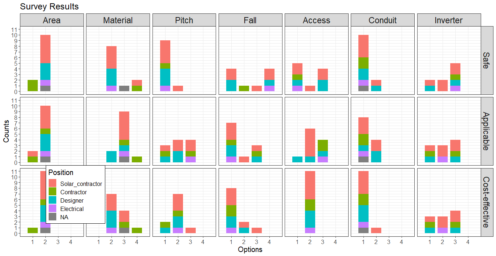

# Prevention through Design (PtD) to Make Solar-Ready Houses Safe for Solar Workers

## Abstract 

Solar-ready designs have become a new standard for residential houses in preparation for the future installation of a solar system on their roofs. However, the current literature largely lacks considerations of the safety of solar installers, and hence, the application of Prevention through Design (PtD) to solar-ready houses has been significantly limited. In response, the main objective of this study is to develop a PtD design checklist and BIM (Building Information Modeling) models for new solar-ready houses. The study involved interviews and a survey with industry professionals, and case studies of existing solar-ready houses. The study results are expected to support designers to proactively get involved in promoting PtD for solar-ready houses—through the use of the checklist and BIM models.

## Key Findings

The key results of this study include:

* Development of a PtD design checklist through a series of interviews and an online survey. The
design features in the checklist include Solar Zone Features, Installation Features, and Electrical Features.

* Development of three BIM models. The models were developed as illustrative examples of solar ready houses featuring design components that are included in the checklist.

The key findings of this study are:

* The current solar-ready codes and requirements are mainly focused on optimizing energy production by securing solar zones for the future installation of a solar system, while lacking considerations of safety of those who will install the system.

* The identified design features include seven components in three categories:

  *Solar Zone Features: Solar Zone Area, Solar Zone Material, and Solar Zone Pitch
  *Installation Features: Fall Protection and Roof Access
  *Electrical Features: Conduit and Inverter

*This study provides evidence that PtD can improve solar installer safety by proactively eliminating safety hazards and mitigating risk — verified through interviews, surveys, and case studies.

## Research Objectives

The overall objective of the study is to develop knowledge and resources that support the application of prevent through design (PtD) to the design of new solar-ready houses. The study will provide evidence that (1) PtD can improve solar worker safety by proactively eliminating safety hazards and mitigating risk; and (2) designers can proactively get involved in promoting PtD for solar-ready houses.

The specific aims of this study are to: (1) investigate design features that support the application of PtD to the design of solar-ready houses by identifying features that either eliminate or create safety risks; (2) categorize components of solar-ready houses that affect safety risk; (3) analyze the identified design features and components through case studies; and (4) develop a PtD design checklist and building information modeling (BIM) model that can be used for making new solar-ready houses safe for solar workers. The study targets solar contractors and their safety, specifically those who work in small businesses. Successful completion of the study will result in the creation of a PtD checklist and procedure which provide house designers the ability to effectively implement PtD for solar-ready houses.

Using mixed methods, the specific tasks of the research are as follows:

1. Perform literature review
2. Investigate design features for solar safety
3. Categorize the components of solar-ready houses
4. Perform case studies of existing solar-ready houses
5. Develop a PtD design checklist and BIM model for new solar-ready houses
6. Obtain industry feedback on the checklist and model
7. Develop and submit a final report

* [Survey](https://github.com/reconjohn/PtD/blob/master/docs/survey/survey.md)
* [Check list](https://github.com/reconjohn/PtD/blob/master/docs/report/checklist/checklist.md)
* [Simple checklist](https://github.com/reconjohn/PtD/blob/master/docs/report/checklist/checklist_sim.md)
* [Solar installation code](https://github.com/reconjohn/PtD/blob/master/docs/literature/code_review.md)
* [Solar-ready code](https://github.com/reconjohn/PtD/blob/master/docs/literature/energy_code.md)
* [OSHA](https://github.com/reconjohn/PtD/blob/master/docs/literature/osha.md)
* [Interview findings](https://github.com/reconjohn/PtD/blob/master/docs/literature/solar_ready.md)
* [Draft report](https://github.com/reconjohn/PtD/blob/master/docs/report/reportA.md)
* [Final report](https://www.cpwr.com/sites/default/files/publications/SS2020-PtD-for-Solar-Ready.pdf)

