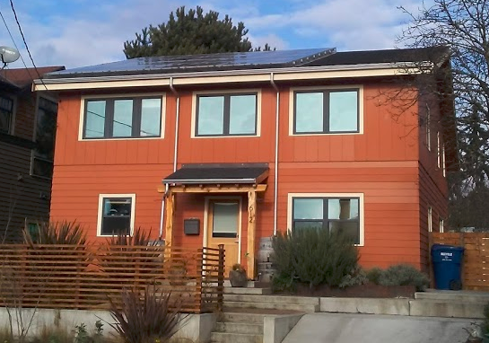
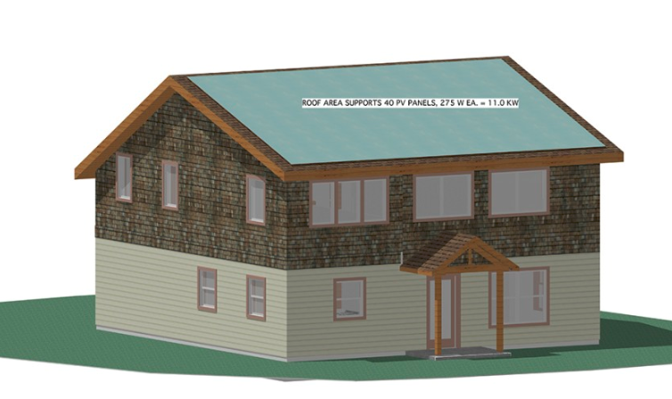
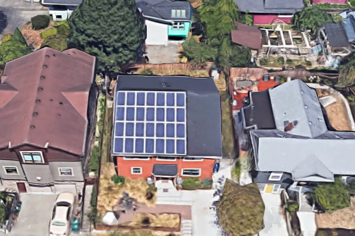
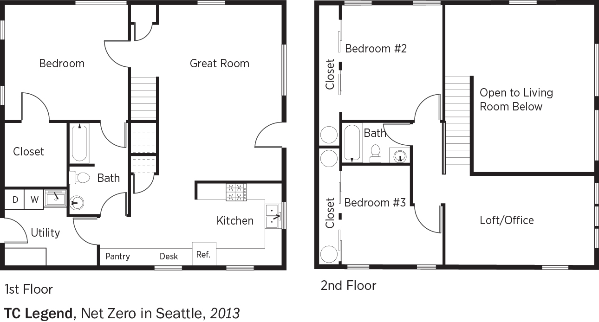

# Case study 1 - Net-zero energy house at 612 NW 60th St., Ballard

  - Year Built: 2011
  - Total Sqft: 1,990 Sqft
  - Foundation: Poured Concrete
  - Environmental Certification: Built Green, Northwest ENERGY STAR
  - Water Heater: Bedroom Closets-Electric
  - Heating: Heat Pump, High Efficiency, Radiant, HEPA Air Filtration
  - Specs: 1,915 square feet, single-family, 2 stories, 3 bedrooms +
    work loft, 2 bathrooms, concrete slab foundation, radiant heat
    floors, Hardie plank siding.

> Grean features: Structural Insulated Panel construction, air-to-water
> heat pump, 6kw solar electric (photovoltaic) system, triple-pane
> windows, passive solar design, rain garden, stained concrete floors,
> reclaimed fir floors, recycled fixtures, zero-VOC paint, low-waste
> engineering, low-energy LED and CFL lighting, capacity for additional
> solar panels (3.4kW) to power an electric car 9,000 miles per year.
> This design was awarded the 2012 National Green Building Award for
> Concept & Research.

Overview of the house

## Solar-ready information

  - Solar contractor: Sunergy Systems in Ballard
  - Solar PV: 230W \* 28 = 6.44kW
  - Inverter type: Power One PVI-6000 Aurora String 6-kW inverter
  - Roof material: Composition
  - Roof pitch: The roof pitch on the side of the roof with the solar
    panels is 4/12. The back side of the roof is 7/12. There is very
    little difference at our latitude and our climate zone in production
    between a 4/12 pitch and an 8/12 pitch. There are a lot of
    subtleties in the design that led to this choice, mostly having to
    do with the convective loop that is developed in the two-story great
    room providing for passive distribution of the in-floor radiant heat
    to the upstairs
    rooms.

<!-- end list -->

    We were pleasantly surprised to find that Ted Clifton Sr. had designed the eaves to let in lots of light when the sun is lower in the sky in the winter but to block nearly all of it during hot summer afternoons, when the sun is higher in the sky - Eric and Alex. 

  - Automated fire sprinkler (in regard to fire code to have 3 ft
    setbacks from roof edges and ridges): No fire sprinkler needed. The
    code allows for closer setbacks under various circumstances,
    including roofs with less than 30% total solar panel coverage, and
    when the fire marshal determines the having a fire-fighter on the
    roof is unnecessary. That is always the case with a SIPS roof.
    Fire-fighter should never be on top of a SIPS structure that is on
    fire, because if the bottom skin of the SIPS fails, the entire roof
    fails. Because there is no enclosed roof truss space that could
    house a fire, there is no need to “ventilate” the roof as they would
    a structure with a trussed or stick-framed roof.
  - Total roof area, south facing area and solar panel area: It is 22’
    from top to bottom of the roof panel as measured along the plane of
    the roof, and the roof is 36’ wide. The 7/12 section on the north
    side has almost the exact same roof area.
  - South facing roof dead and live load: The live load is 25 lbs for
    snow, 5 lbs for the solar panels, plus 15 lbs for the SIPS
    structure, total of 45 lbs.
  - Reason to install solar electrical balance of systems (BOS) outdoor
    as opposed to indoor: It would be easier to add more panels and a
    second inverter (to charge and electric car in the future) if the
    inverter was outside. They are locataed on the West wall.
  - How to coordinate with solar contractor for the design and
    installation interacting with roofers: They do this all the time, it
    is not an issue.
  - Permanent tie-off or anchor point on the top of the roof is
    installed.
  - Normal access the rooftop of this house is by a ladder.

House 3D model

Roof overview in google

Site plan

## Energy investment

  - Space heat demand: 3.3 MMBtu/yr (1723 BTU/ft2/yr)
  - Energy used on site (12 months): 6,064 kWh
  - Energy produced on site (12 months): 7,903 kWh
  - Net energy balance (12 months): 1,429 kWh surplus
  - HERS index: -1
  - Annual utility costs: -$95
  - Annual energy cost savings: $2,700
  - Annual energy savings: $114,000 (in 30
    years)

<!-- end list -->

    The cost of the land was $180,000, and construction, solar panels, taxes, and permits added another $237,000. After a $9,000 federal rebate for the solar panels, and an approximately $9,000 WA solar production credit (paid out over 9 years), the grand total came to about $399,000. The cost to build was only $124 per square foot ($114 if rebates and incentives are counted), whereas the average in Seattle is $200 per square foot. Plus, there is no energy cost, which comes to about $150 per month, or $1,800 per year, for the average Seattle household.

## Reference

  - General
    Spec.(<https://www.estately.com/listings/info/612-nw-60th-st>)
  - Eco-building
    (<http://www.ecobuilding.org/green-building/project-spotlights/ballard-net-zero-energy-house>)
  - Feedback from the homeowner
    (<https://www.greenbuildingadvisor.com/green-homes/a-net-zero-energy-house-for-125-a-square-foot>)
  - DOE case study
    (<http://zero-energyplans.com/wp-content/uploads/BA_ChallengeHome_TCLegendHomes_100113.pdf>)
  - 2013 U.S. Department of Energy Housing Innovation Award
    (<https://www.energy.gov/eere/buildings/doe-tour-zero-net-zero-seattle-tc-legend-homes>)
  - Gallary
    (<http://www.tclegendhomes.com/portfolio-of-work/2014/7/1/ballard-net-zero-energy-house>)
  - Google Solar
    (<https://www.google.com/get/sunroof#a=612%20NW%2060th%20St,%20Seattle,%20WA%2098107,%20USA&b=80&f=buy&np=30&p=1>)
  - Virtual tour
    (<https://my.matterport.com/show/?m=wTgqKusWonu&brand=0>)
  - Building design (<http://zero-energyplans.com/plans/mb-2/>)
