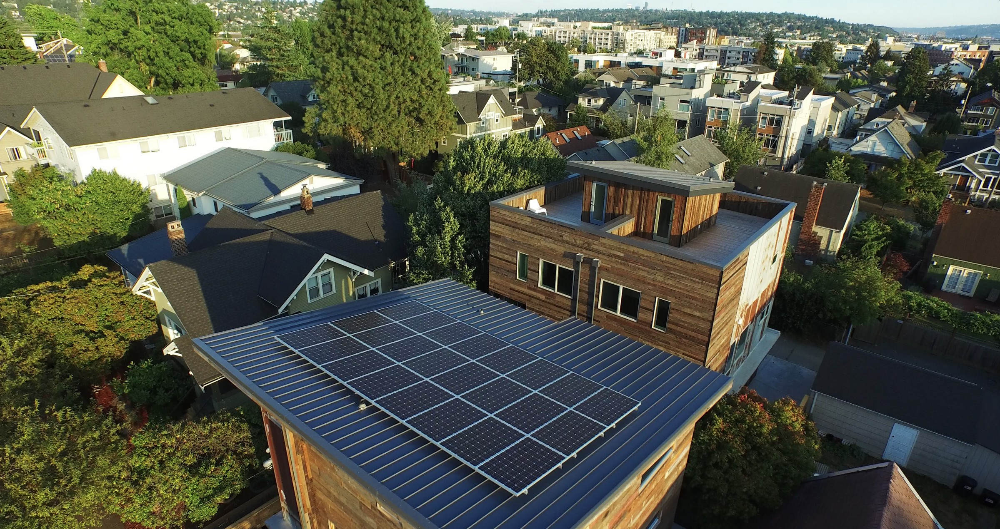
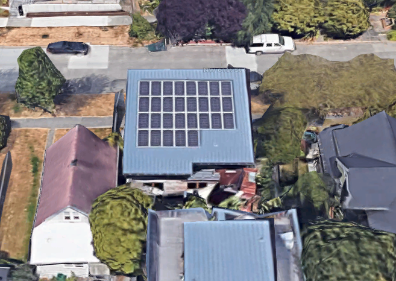
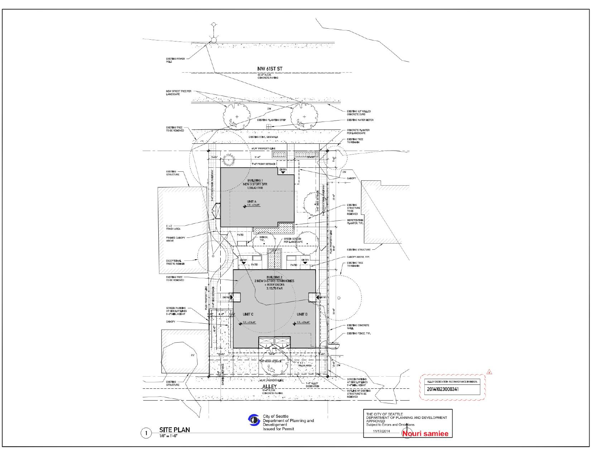

---
output:
  html_document: default
header-includes:
- \usepackage{float}
- \floatplacement{figure}{H}
- \usepackage[fontsize=12pt]{scrextend}
---

# Case study 3 - EMERALD STAR at 1749 NW 61st ST Seattle

* Year Built: 2015
* Total Sqft: 2,218 Sqft
* Environmental Certification: Emerald star (3rd in the nation)
* Specs: single-family, 3 stories, 3 Bedrooms, 2.5 Bathrooms

> Emerald star certified homes: required to achieve net zero energy using a renewable source in addtion to 70% reduction in water use, 90% reclaimed or FSC certified wood materials, and exceptional indoor air quality.

## Solar-ready information 

* Solar contractor: Puget sound solar
* Solar PV: 280W * 29 = 8.1kW
* Inverter type: Micro inverter
* Roof material: Metal
* Tie-off: 2 anchor points installed 
* Roof pitch: 2/12 (9.5 degree)
* Access: With a ladder
* South facing roof area and solar panel: 33' x 35' 
* Electrical BOS location: On the East side of wall
* Conduit pathway: Internal wall 

## Energy investment

* HERS index: 45 (0 with PV)
* Annual utility costs: $0 (estimated)
* Annual Energy cost savings: $1,628 (estimated)
* Annual energy savings: 18,090 kWh ($70,000 in 30 years)

  

Roof overview 

  

Roof overview in google 

  

Site plan 

## Reference

* Dwell homepage (https://www.dwelldevelopment.com/portfolio/ballard-emerald-star-zero-energy-home/)
* Emerald star (https://www.builtgreen.net/docs/librariesprovider2/resources/built_green_emerald_star_results_white_paper_web_0218.pdf)
* 2016 U.S. Department of Energy Housing Innovation Award (https://www.energy.gov/eere/buildings/doe-tour-zero-emerald-star-dwell-development)
* Gallary (https://archello.com/project/emerald-star)
