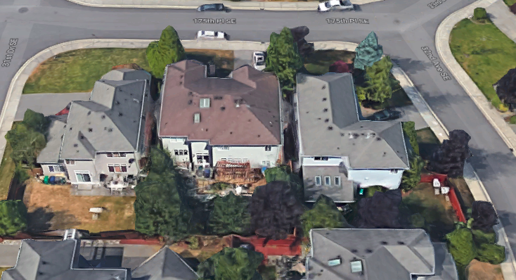

---
output:
  html_document: default
header-includes:
- \usepackage{float}
- \floatplacement{figure}{H}
- \usepackage[fontsize=12pt]{scrextend}
---

# Case study 3 - 3120 175th Pl. SE, Bothell

* Year PV installed: 2018

## Solar-ready information 

* Solar contractor: Artisan
* Solar PV: 300W * 35 = 10.5kW
* Inverter type: Power optimizer
* Roof material: Compositions
* Tie-off: 
* Roof pitch: 
* Access: With a ladder
* Solar panel area: Split installation of solar PV area (631 sqft) on East, South and West 
* Electrical BOS location: On the South side wall
* Conduit pathway: External wall on South side wall 

## Energy investment

* Annual Energy production: 10,355 kWh (estimated)

  

Roof with PV overview 

  

Roof overview in google 

  

Site overview 

## Reference

