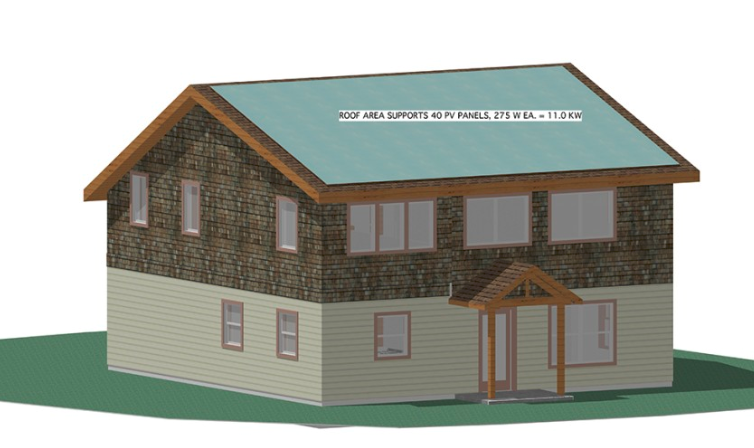

---
output:
  pdf_document: default
  html_document: default
header-includes:
- \usepackage{float}
- \floatplacement{figure}{H}
- \usepackage[fontsize=12pt]{scrextend}
---
# Case study - Net-zero energy house at 612 NW 60th St., Ballard

* Year Built: 2011
* Total Sqft: 1,990 Sqft
* Foundation: Poured Concrete
* Environmental Certification: Built Green, Northwest ENERGY STAR
* Water Heater: Bedroom Closets-Electric 
* Heating: Heat Pump, High Efficiency, Radiant, HEPA Air Filtration
* Specs: 1,915 square feet, single-family, 2 stories, 3 bedrooms + work loft, 2 bathrooms, concrete slab foundation, radiant heat floors, Hardie plank siding.

> Grean features: Structural Insulated Panel construction, air-to-water heat pump, 6kw solar electric (photovoltaic) system, triple-pane windows, passive solar design, rain garden, stained concrete floors, reclaimed fir floors, recycled fixtures, zero-VOC paint, low-waste engineering, low-energy LED and CFL lighting,  capacity for additional solar panels (3.4kW) to power an electric car 9,000 miles per year. 

## Solar system information 

* Solar contractor: Sunergy Systems in Ballard
* Solar PV: 230W * 28 = 6.44kW
* Inverter type: Not sure. 
* Roof material: Composition.
* Roof pitch: The roof pitch on the side of the roof with the solar panels is 4/12. The back side of the roof is 7/12
* Automated fire sprinkler (in regard to fire code to have 3 ft setbacks from roof edges and ridges): No fire sprinkler needed. The code allows for closer setbacks under various circumstances, including roofs with less than 30% total solar panel coverage, and when the fire marshal determines the having a fire-fighter on the roof is unnecessary. That is always the case with a SIPS roof.
* Total roof area, south facing area and solar panel area:  It is 22' from top to bottom of the roof panel as measured along the plane of the roof, and the roof is 36' wide.  The 7/12 section on the north side has almost the exact same roof area.
* South facing roof dead and live load: The live load is 25 lbs for snow, 5 lbs for the solar panels, plus 15 lbs for the SIPS structure, total of 45 lbs.
* Reason to install solar electrical balance of systems (BOS) outdoor as opposed to indoor: It would be easier to add more panels and a second inverter (to charge and electric car in the future) if the inverter was outside.
* How to coordinate with solar contractor for the design and installation interacting with roofers: They do this all the time, it is not an issue.

> This design was awarded the 2012 National Green Building Award for Concept & Research.

### Energy investment 
> The cost of the land was $180,000, and construction, solar panels, taxes, and permits added another $237,000. After a $9,000 federal rebate for the solar panels, and an approximately $9,000 WA solar production credit (paid out over 9 years), the grand total came to about $399,000. The cost to build was only $124 per square foot ($114 if rebates and incentives are counted), whereas the average in Seattle is $200 per square foot. Plus, there is no energy cost, which comes to about $150 per month, or $1,800 per year, for the average Seattle household.

* General Spec.(https://www.estately.com/listings/info/612-nw-60th-st)
* Spec. 2 (http://www.ecobuilding.org/green-building/project-spotlights/ballard-net-zero-energy-house)
* Google Solar (https://www.google.com/get/sunroof#a=612%20NW%2060th%20St,%20Seattle,%20WA%2098107,%20USA&b=80&f=buy&np=30&p=1)
* Virtual tour (https://my.matterport.com/show/?m=wTgqKusWonu&brand=0)
* Zero energy (http://zero-energyplans.com/plans/mb-2/)
