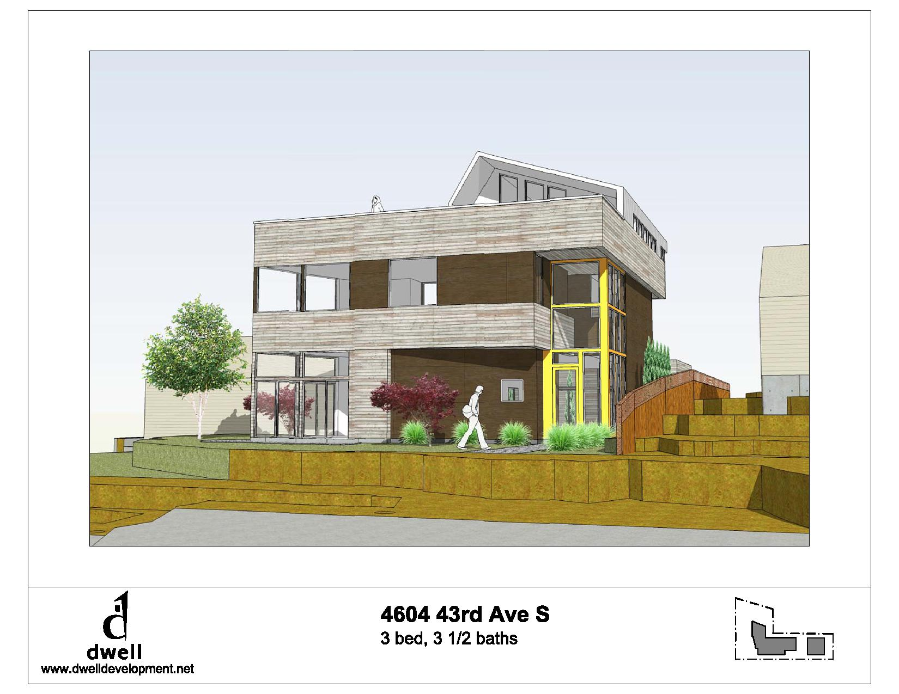
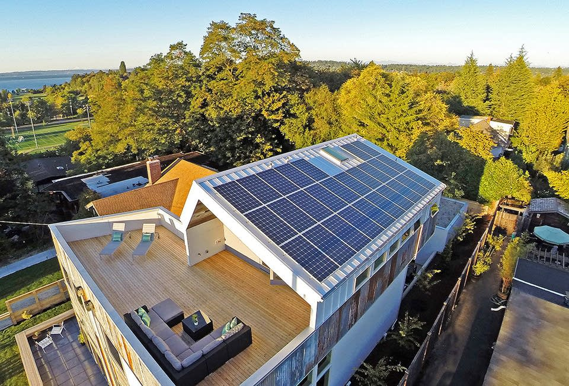
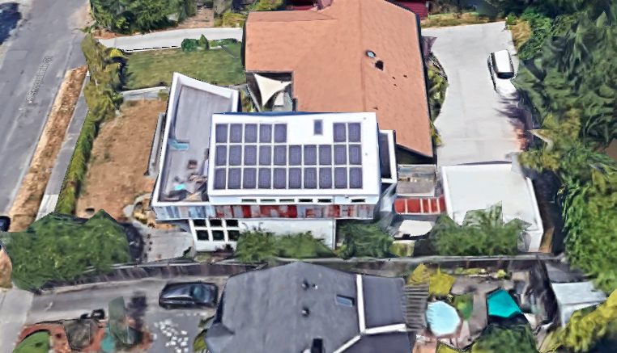
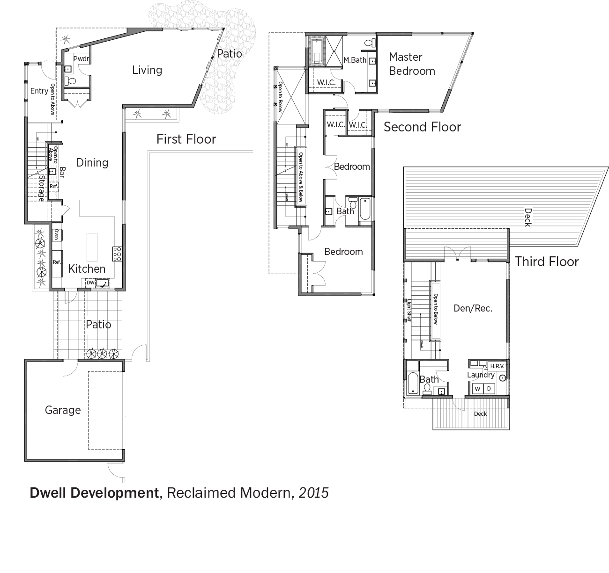

---
output:
  html_document: default
header-includes:
- \usepackage{float}
- \floatplacement{figure}{H}
- \usepackage[fontsize=12pt]{scrextend}
---

# Case study 2 - RECLAIMED MODERN at 4606 43rd Ave South Seattle

* Year Built: 2014
* Total Sqft: 3,140 Sqft
* Environmental Certification:  5 Star Built Green
* Specs: single-family, 3 stories, 4 Bedrooms, 3.5 Bathrooms

> Grean features: triple-glazed windows, radiant heating, a heat recovery ventilation system, electric vehicle charging, use of salvaged materials including truckloads of wood and corrugated metal taken from a deconstructed barn in Oregon’s Willamette Valley. This project got the 2015 Seattle Design Awards, Best Green Design. 

## Solar-ready information 

* Solar contractor: Puget sound solar
* Solar PV: 270W * 27 = 7.29kW
* Inverter type: Micro inverter
* Roof material: Metal
* Tie-off: 4 anchor points
* Roof pitch: 8/12 (33.69 degree)
* Access: With a ladder on the deck
* Total roof area, south facing area and solar panel area: 20' x 38' 
* Electrical BOS location: On the North side of wall
* Conduit pathway: Internal wall 

## Energy investment

* HERS index: 55 (25 with PV)
* Annual utility costs: $685 (estimated)
* Annual energy cost savings: $936 (estimated)
* Annual energy savings: 82.7 MMBtu ($52,000 in 30 years)

  

House 3D model 

  

Roof overview 

  

Roof overvie in google 

  

Site plan 

## Reference

* 2015 U.S. Department of Energy Housing Innovation Award (https://www.energy.gov/eere/buildings/doe-tour-zero-reclaimed-modern-dwell-development)
* Dwell homepage (https://www.dwelldevelopment.com/portfolio/columbia-city-reclaimed-modern-home/)
* Gallary (https://archello.com/project/reclaimed-modern)

