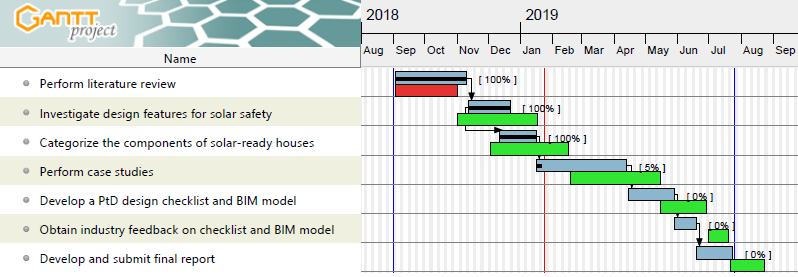

# Research Objectives

The overall objectives of the study is to develop knowledge and resources that support the application of prevent through design (PtD) to the design of new solar-ready houses. The study will provide evidence that (1) PtD can improve solar worker safety by proactively eliminating safety hazards and mitigating risk; and (2) designers can proactively get involved in promoting PtD for solar-ready houses.

The specific aims of this study are to: (1) investigate design features that support the application of PtD to the design of solar-ready houses by identifying features that either eliminate or create safety risks; (2) categorize components of solar-ready houses that affect safety risk; (3) analyze the identified design features and components through case studies; and (4) develop a PtD design checklist and building information modeling (BIM) model that can be used for making new solar-ready houses safe for solar workers. The study targets solar contractors and their safety, specifically those who work in small businesses. Successful completion of the study will result in the creation of a PtD checklist and procedure which provide solar designers the ability to effectively implement PtD for solar systems.

Using mixed methods, the specific tasks of the research are as follows:

1. Perform literature review
2. Investigate design features for solar safety.
3. Categorize the components of solar-ready houses.
4. Perform case studies of existing solar-ready houses.
5. Develop a PtD design checklist and BIM model for new solar-ready houses.
6. Obtain industry feedback on the checklist and model.
7. Develop and submit a final report

# Accomplishments

1. Extensive literuature reviews including the previous CPWR study (Lee at al. 2017) were conducted to indentify (1) the design and construction of solar-ready houses and (2) the safety hazards and risk mitigation measures for solar systems. 7 design related components identified in the previous study are roofing material, roof slope, roof accessories, panel layout, fall protection system, lifting method, and electric system with respect to the 3 main safety hazards, which are falling, tripping and being struck by objects. They are prevalent specifically in working on rooftop due to the factors including, but not limited to stability of the roof, placement of the ladder, weather conditions, holes in the roof, proximity of the edges, and pitch of the roof, which will be considered for the next steps of development of desirable design features and checklist of solar-ready houses.

2. Industry interviews were performed to capture specific features to improve the safety features of solar installation. These industry interviewees were identified through the previous CPWR study and researcher's connection all located in the Pacific Northwest. The researchers tried to select the professionals diversely to capture the broad perspectives from field workers to the company princials. Total interviewees are 12 professionals based on different levels of job types consisting of 1 sustainability consultant, 3 solar contractors, 1 general contractor, 2 electric professionals and 5 designers (including principal).

3. A list of building components applying desirable design features was developed through email surveys with the industry professionals who participated the previous interviews. The survey evaluated the desirable design features for the related buliding components. The evaluation criteria is (1) relevance to safety hazard risks, (2) applicability, and (3) cost-effectiveness.

# Deviations/Issues in the Research Methodology

Progress of the research project is ahead of the planned schedule while it is expected to take time to find the case studies for this research. Below shows the progress in detail indicating activities delayed in read and ahead in green. 

Survey through e-mail is about to be performed to verify the design preference for each evaluation criteria (i.e., safety, applicability, and cost-effectiveness) while some of the preferred design characteristics were verified during the interviews. 

# Interim Results
Through the interviews, it is identified that most hazardous activities are installation of the safety equipments such as tie-off and anchor points and carrying solar panels to the roof. Typical work processes of solar system installation start with installing safety equipments followed by installation of mechancial and electrical balance of system (BOS) such as mounting racks and overcurrent protection device (OCPD). Carrying and positioning solar panels are next followed by installation of final accessories. Hence, PtD measures would help to address these hazardous activities more by preventing them from occurrence through design improvement.

In addition, interviews verified the benefits of solar-ready scope in terms of cost-effectiveness, productivity, occupational safety, asset marketability and green adoption. The solar-ready scope mostly lessens the soft cost by reducing it related to system permitting, pre-construction engineering, marketing, and installation labor time at risk of being on the roof. It also increases the installation productivity leading to higher occupational safety by promoting easier access, simple layout, no tripping hazards, and no openings. Interviews found that solar-ready scope enhances the value of the houses as most solar-ready projects have been marketed with the solar-ready features stressed out.

There were some concerns about the solar-ready scope that the residential solar federal tax credit is not applied to the solar-ready scope even though there is a rare case that provided incentive to builders (e.g., Oregon energy trust EPS). While it seems there is no more incentive to builders for applying solar-ready scope in the new construction, the trend is that solar-ready scope becomes required by the local residential building or energy codes.

Design features related to buliding components and solar system features were verified for solar-ready houses: solar zone features, installatoin features and solar system features. The solar zone is a designated area for the future installation of solar panels on the roof or overhang without interruption of shades, penetrations, and obstrcutions. Solar zone features are devided into solar zone area, solar zone pitch and solar zone material. Designers could consider the solar zone features different from the typical rooftop as those areas not included in solar zone have nothing to do with the design limits for solar zone. Installation features determine how solar workers perform the installation in terms of fall protection, access to the roof and electrical configuration, which indentifies the conduit routes and reserved spaces for electrical equipments of the solar system depending on the inverter type. In case there is a time gap between solar scope in the new construction and the solar system installation, solar system features include electrical configuration for interter types in addtion to the mounting types such as rack and ballast.

