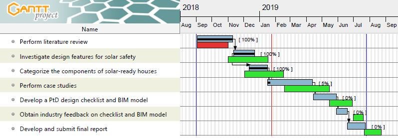

# Research Objectives

The overall objective of the study is to develop knowledge and resources that support the application of prevent through design (PtD) to the design of new solar-ready houses. The study will provide evidence that (1) PtD can improve solar worker safety by proactively eliminating safety hazards and mitigating risk; and (2) designers can proactively get involved in promoting PtD for solar-ready houses.

The specific aims of this study are to: (1) investigate design features that support the application of PtD to the design of solar-ready houses by identifying features that either eliminate or create safety risks; (2) categorize components of solar-ready houses that affect safety risk; (3) analyze the identified design features and components through case studies; and (4) develop a PtD design checklist and building information modeling (BIM) model that can be used for making new solar-ready houses safe for solar workers. The study targets solar contractors and their safety, specifically those who work in small businesses. Successful completion of the study will result in the creation of a PtD checklist and procedure which provide house designers the ability to effectively implement PtD for solar-ready houses.

Using mixed methods, the specific tasks of the research are as follows:

1. Perform literature review
2. Investigate design features for solar safety
3. Categorize the components of solar-ready houses
4. Perform case studies of existing solar-ready houses
5. Develop a PtD design checklist and BIM model for new solar-ready houses
6. Obtain industry feedback on the checklist and model
7. Develop and submit a final report

# Accomplishments

1. An extensive literature review including the previous CPWR study (Lee at al. 2017) was conducted to identify (1) the design components and construction operations of solar-ready houses, and (2) the safety hazards and risk mitigation measures for solar systems. Seven design-related components identified in the previous study as being impactful to safety are: roofing material, roof slope, roof accessories, panel layout, fall protection system, lifting method, and electric system. These components were identified with respect to the three main safety hazards, which are falling, tripping, and being struck by objects. The hazards are prevalent specifically when working on a rooftop due to a variety of factors including, but not limited to, stability of the roof, placement of the ladder, weather conditions, openings in the roof, proximity of the roof edges, and pitch of the roof. These factors will be considered for the next steps in the development of desirable design features and a design checklist of solar-ready houses.

2. A series of industry interviews were performed to capture specific features to improve the safety of solar installations. The interviewees were identified through the previous CPWR study and the research team's connections with industry, all located in the Pacific Northwest. The team tried to select a diverse set of the professionals to participate in the interviews to capture broad perspectives from the field workers to the company principals. A total of 12 industry professionals were interviewed. The interviewees included one sustainability consultant, three solar contractors, one general contractor, two electric professionals, and five designers (including principal).

3. A list of building components applying desirable design features was identified through a series of interviews and has been being developed currently with an online survey to professionals who participated the previous interviews. The survey evaluates the desirable design features for the related building components. The evaluation criteria are: (1) relevance to safety hazard risks, (2) applicability, and (3) cost-effectiveness.

# Deviations/Issues in the Research Methodology

Progress on the research project is slightly ahead of the planned schedule and the case study process has started. The figure below shows the progress in detail indicating activities delayed in red and activities ahead of schedule in green.

An online survey is being performed to develope the design features preferred by industry practitioners based on each evaluation criteria (i.e., safety, applicability, and cost-effectiveness). Note that some of the preferred design features were verified during the interviews.

# Interim Results
The interview results revealed that most safety hazards and risks happen during the installation of the safety equipment such as tie-off and anchor points and during the process of carrying solar panels to the roof. Typical solar system installation starts with installing safety equipment followed by installation of mechanical and electrical balance of system (BOS) such as mounting racks and an overcurrent protection device (OCPD). Carrying and positioning solar panels are the next step followed by installation of final accessories. Hence, the application of PtD to the design features would help to address these hazardous activities effectively during the design process.

In addition, the interview results reported the benefits of solar-ready design in terms of cost-effectiveness, productivity, occupational safety, asset marketability, and green adoption. The solar-ready design can largely contribute to lowering the soft cost of solar systems by reducing time taken for system permitting, pre-construction engineering, marketing, and installation (when workers are at risk of being on the roof). It also helps increase the installation productivity, leading to improving occupational safety by promoting easy access, simple layout, fewer tripping hazards, and fewer openings. Some interviewees pointed out that the solar-ready design can enhance the value of the solar-ready houses due to the marketing of the solar-ready features.

During the interviews, there were some concerns raised about solar-ready design. Specifically there were concerns that most federal tax credits for residential solar are currently not applicable to solar-ready design except for a rare case reported in Oregon energy trust EPS that provides incentive to contractors. While there does not seem to be any more incentive available for contractors in terms of applying solar-ready design in new construction, the general trend in the industry is that solar-ready design becomes required by the local residential building or energy codes more and more over time.

PtD design features related to building components and solar system features were verified and categorized for solar-ready houses, including solar zone features, installation features and solar system features. A solar zone refers to a designated area for the future installation of solar panels on the roof or overhang without interruption due to shade, penetrations, and obstructions. First, the solar zone features include solar zone area, solar zone pitch, and solar zone material. Designers should consider these features in terms of design constraints (e.g., rearranging obstructions such as vents, chimneys, and roof-mounted) for the application of solar zone as opposed to the typical rooftop design. Second, the installation features are about how solar workers perform their installation in terms of fall protection, access to the roof, and electrical configuration, that determines the conduit routes and reserved spaces for electrical components of the solar system depending on the inverter type. Lastly, the solar system features are intended to address a significant time gap between solar-ready design in the new construction and actual solar system installation in the future. The identified solar features include electrical configuration for inverter types and mounting types such as racking and ballast.
