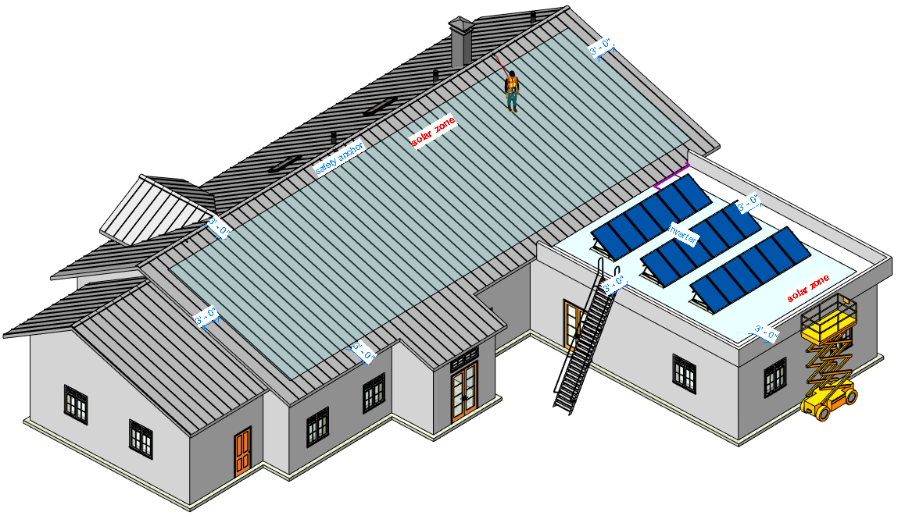

```{r setup, include=FALSE, fig.align="center"}
knitr::opts_chunk$set(echo = F)
library(tidyverse)
library(lubridate)
library(readxl)
library(kableExtra)
library(knitr)
load("../../data/sur.Rdata")
```


# Introduction

Solar installation in the U.S. has increased dramatically in recent years. Specific to the residential sector, the number of houses with solar modules increased exponentially from 30,000 homes to 1 million homes in 10 years from 2006 to 2016, with record growth in 2015 (Harrington 2015; GTM/SEIA 2017). Most solar installations in the residential sector happen on small, sloped roofs and as a result, installers are subject to unique safety concerns in terms of existing roof conditions. Furthermore, the installation process involves roofing, electrical and mechanical work, and IT causing hazards to installers. To prevent those unique safety hazards and risks, especially related to fall hazards during solar installations, a previous The Center for Construction Research and Training (CPWR)-supported small study conducted by the researchers investigated how Prevention through Design (PtD) can be applied to solar design and installation for small buildings (Lee et al. 2017). The small study led to the identification of seven PtD attributes based on roof conditions and rooftop solar system (hereafter solar system) characteristics: roofing material, roof slope, roof accessory, module layout, fall protection system, lifting method, and electrical system. Based on the identified PtD attributes, the researchers developed a PtD protocol for solar installer safety. For broader nationwide dissemination, the protocol was presented through a CPWR webinar on December 13, 2017.

While the previous study focused on applying PtD to existing houses, the study actually revealed that to maximize the efficacy of PtD for solar installer safety, the application of PtD should also be considered for new houses as a way to make them solar-ready. To that end, during the final seminar conducted in the small study, the research team asked solar contractors what house features would make residential solar installation safer. The followings are excerpts from some of their responses:

* “Nothing extruding from the roof on the south side of the house”
* “No shake roofs, no tile roofs”
* “Having roof anchors or anchor points ready”
* “Pre-wired for solar system electrical connections”

Making new commercial buildings solar-ready has become a requirement in cities like Seattle, WA, and San Francisco, CA. These cities are mendating solar-ready to the residential sector as well. Phoenix Building Construction Code added solar-ready provisions to detached one and two family dwellings on proposed amendment to the 2018 Internatial Residential Code (IRC). Furthermore, California's 2019 residential building energy efficiency standards include solar installation mendate and solar-ready for all residential buildings. Currently, there are some guidelines available to support the design of solar-ready buildings (e.g., Watson et al. 2012, EPA 2011; Lisell et al. 2009). However, the current literature largely lacks considerations of the safety of solar installers, and hence the application of PtD to solar-ready houses has been significantly limited. In response, this study aims to fill this knowledge gap by developing a design checklist to apply PtD to the design of houses to make them both solar-ready and safer for solar installations. The results of the previous CPWR study (Lee et al. 2017) significantly contributed to the successful completion of the study by serving as a foundation for the development of the design checklist. In particular, the study is expected to showcase how the design community can be involved in promoting the concept of PtD during the design of green buildings that pursue sustainability and energy efficiency.

# Research objectives

The overall objective of the study is to develop knowledge and resources that support the application of PtD to the design of new solar-ready houses. The study is expected to provide evidence that (1) PtD can improve solar installer safety by proactively eliminating safety hazards and mitigating risk; and (2) designers can proactively get involved in promoting PtD for solar-ready houses.

Using mixed methods, the specific tasks of the research are as follows:

1. Perform literature review
2. Investigate design features for solar safety
3. Categorize the components of solar-ready houses
4. Perform case studies of existing solar-ready houses
5. Develop a PtD design checklist and BIM (building information model) for new solar-ready houses
6. Obtain industry feedback on the checklist and model
7. Develop and submit a final report

# Perform literature review

An extensive literature review was conducted to identify (1) the design components and construction operations of solar-ready houses, and (2) the safety hazards and risk mitigation measures for solar systems. Seven PtD components identified in the previous study (Lee et al. 2017) are: roofing material, roof slope, roof accessories, module layout, fall protection system, lifting method, and electric system. These components were identified with respect to the three main safety hazards, which are falling, tripping, and being struck by objects. The hazards are prevalent specifically when working on a rooftop due to a variety of factors including, but not limited to, stability of the roof, placement of the ladder, weather conditions, openings in the roof, proximity of the roof edges, and pitch of the roof. These factors were considered for the next steps in the development of desirable design features and a design checklist of solar-ready houses.

In addition, energy codes were reviewed to identify the safety features in the requirements. Each state has adopted or developed energy code from the federal government’s energy standard such as International Energy Conservation Code (IECC). California has its own standards (2016 Building Energy Efficiency Standards Title 24, Part 6) exceeds the requirements of 2015 IECC. California requires rooftop solar installation on new construction or solar-ready for those who are exempt from the rooftop solar installation [@cec2016BuildingEnergy2016]. The newly updated 2018 IECC has APPENDIX RA solar-ready provisions, which include solar ready requirements for detached, and one and two family dwellings and townhouses [@2018InternationalEnergy2018]. The 2017 residential code is in effect in Seattle [@seattleResidentialCodeSDCI2017]. The requirements for residential solar-ready are in residential code while commercial solar-ready requirements are in energy code, not building code. For reference, single family and low rise multifamily are related to residential code (a kind of building code only for residential) otherwise building code. Electrical permit, which is related to electrical code from National Electric Code (NEC), is required after a solar system is installed.

Solar-ready requirements, in general, found in these energy codes are mainly focusing on securing solar zones for the easier implementation and installation in the future in terms of dimension, area and orientation. A solar zone refers to a designated area for the future installation of solar modules on the roof or overhang without interruption due to shade, penetrations, and obstructions [@cec2016BuildingEnergy2016]. These codes demand solar zone to be larger than a certain area depending on the total available roof area in addition to load, electric interconnection, and documentation requirements. While these requirements are primarily to ensure reserved spaces for the future solar modules on the roof, having solar zones itself is expected to entail occupationally safer conditions for installers to install the system. It is because securing a solar zone will prevent any obstructions from occurring on the roof where a solar system is going to be installed. Obstruction on roof is the one of factors causing tripping hazards.


# Investigate design features for solar safety

A series of interviews with industry practitioners were performed to capture specific features that can be considered for improved safety of solar installations. All located in the Pacific Northwest, the interviewees were identified through the previous CPWR study and the research team's connections with industry. The team tried to select a diverse set of the professionals for interviews so as to capture broad perspectives from the field installers to the company principals. A total of 12 industry professionals were interviewed. The interviewees included one sustainability consultant, three solar contractors, one general contractor, two electric professionals, and five designers (including two principals).


```{r}
data <- read_excel("../interview/contact.xlsx", sheet = 3)[1:6]
# View(data)

kable(data, caption = "List of interviews") %>%
  kable_styling(bootstrap_options = c("striped", "hover","condensed"), full_width = F, 
                position = "center") %>%
  column_spec(3, width = "1em") %>%
  column_spec(6, width = "1em")

```

The interviews led to identification of design features with recommendations to improve safety of installers for rooftop solar installation. 

## Roof area

First, it is confirmed that there should be no obstruction around roof area where a solar system is going to sit on to avoid a trip hazard. Mounting accessories such as foots for racks and rails, could be pre-installed. Having simple roof shape is preferred for the sake of solar installers. For a complicated roof shape, the use of composition material would make the installation work easier and safer. It would be safer to have access gaps between modules for installers to walk around during the work.

## Roof pitch and flat roof

When it comes to roof pitch, lower than 5/12 – 7/12 (depending on the roofing material and climate) was suggested for the safety of solar installers while the optimal pitch for energy production is depending on the local attitude (8/12 is the optimal in Northwest). If it is a lower pitch, any roofing material would be fine in terms of safety. There were, however, some concerns about flat roof because they may require the use of ballast mounting for solar modules. Additional structural analysis would be required for flat roof in order to accommodate ballast mounting structures and their weights. In addition, if solar installation on flat roof requires membrane penetration, water intrusion issues should be verified by a roofing expert. A solar system with ballast mounting may also incur additional engineering cost and a building permit. Furthermore, flat roof is a bit harder to have overhang while overhang is necessary in a climate such as Seattle to protect a house from the frequent rain while. It was told that accessing flat roof would be harder because most residential houses with flat roof are, in general, taller in order for securing more space on the top floor level.

## Roof material 

Composition, overall, is better for safety since it is easier to work on, leading to less slippery condition while composition was told poor in maintenance. It is because composition involves moss growth, and it is less durable, which incurs replacement of the roofing material and reinstallation of solar modules costing 25% of the initial cost for labor. Durable roofing material is suggested to be metal although it could be slippery to walk on and may cause heatstroke during Summer. In general, typical metal roof entails no penetration to install a solar system that makes solar installers easier and safer to work. On the other hand, tile and shake are easy to crack and it takes longer to install a solar system on them. In addition, shakes have a fire hazard. Housing aesthetics is, with the development of modern design, the other factor to consider for the roofing material.

## Fall protection and access

Anchor points or tie-offs are suggested to be pre-installed on rooftop as it would be more dangerous to install them after construction. There is, however, a liability issue for homeowners to install the anchor points such that any accidents related to the homeowner-installed tie-offs could endanger the homeowner in regard to reliability and maintenance of the tie-offs, which are not required to be installed in building code. There were additional options recommended such as access pathway, snow guard and guardrail as the means of fall protection. Access pathways are required by International Fire Code (IFC) 605.11.3.2, if certain conditions were not met. For the purpose of safety, it is better to have access pathways for accessing and securing space on roof even if access pathways are not required to have. Lower height was told to be better for safety. Creative access point may be needed depending on the house neighbors for delivery of material and people because some house neighbors are close each other having no space to put a ladder. Lower pitch makes easier access in this regard by allowing a gentle slope of a ladder.

## Electrical issues 

Overhead powerlines is another factor to watch out during the work. A recent incident cited by Occupational Safety and Health Administration (OSHA) about fatal electrocution, leads to the company facing penalties at Kansas [@ecmSolarContractorCited2019]. “This tragedy could have been prevented if the employer had complied with electrical standards that require maintaining a safe distance from unprotected energized power lines, training employees, and providing personal protective equipment,” said OSHA Wichita Area Director Ryan Hodge. Conduit for a solar system is suggested to be pre-run because it would be easier to run them during new construction with less manpower. It will be complicated to run conduit internally by opening walls in the future. Aesthetics is the other factor to consider for conduit and inverter location. Reserving spaces for electric equipment on the same side or near was recommended. In regard to inverter type, the concern was more about economical efficiency such that micro inverter and power optimizer are preferred for small system such as less than 35 solar modules, otherwise string inverter is suggested for systems like commercial projects. Micro inverter and power optimizer are also safer in terms of rapid shutdown, which is required to disperse direct current (DC) for a short period of time (all conductors within an array’s 1-ft boundary have to be reduced to 80 V or less within 30 seconds of rapid shutdown initiation - NEC 2017).

In summary, the interview results revealed that most safety hazards and risks happen during the installation of the safety equipment such as tie-off and anchor points and during the process of carrying solar modules to the roof. Typical solar system installation starts with installing safety equipment followed by installation of mechanical and electrical balance of system (BOS) such as mounting racks and an overcurrent protection device (OCPD). Carrying and positioning solar modules are the next step followed by installation of final accessories. Hence, the application of PtD to the design features would help to address these hazardous activities effectively during the design process.


# Categorize the components of solar-ready houses

A list of building components pertaining to the identified design features were first identified through the interviews. Then, an online survey was performed to rank the design features preferred by industry practitioners including those who participated in the previous interviews. The ranking was based on evaluation criteria including (1) relevance to safety hazard risks, (2) applicability, and (3) cost-effectiveness. The relevance to safety hazard risks is a criterion to measure how safe it is to have the concerned component for installer safety. Applicability is a criterion that leads to the easiest application in practical. Cost-effectiveness refers to the most economical option. Based on the interviews, the identified design features are grouped into eight categories (solar zone area, solar zone material, solar zone pitch, fall protection, access to roof, conduit for the future rooftop solar, solar system inverter, and solar system mounting) to specify which feature in each section is the most desirable.

## Solar zone area

The majority of professionals consider one continuous zone is more desirable than the multi-split zones for all criteria. One of the reasons was captured that given the same size of system, installation of the system in several areas would complicate the work and incur installation of additional accessories.

## Solar zone material

Composition is the most desirable in the safety criteria while metal (standing seam) is the one as far as applicability is concerned. When it comes to the cost-effectiveness, composition and metal are considered almost the same. In general, metal is expensive with higher upfront cost. Metal, however, could be cost-effective as much as composition with respect to durability and maintenance in a long run. 

## Solar zone pitch

Flat is the safest feature for solar zone pitch in the survey. Lower slope is desirable in cost-effectiveness criteria. OSHA defines a low-slope roof as a roof having a slope of less than or equal to 4 inches of vertical rise for every 12 inches horizontal length (standard no. 1926.500).

## Fall protection

Hitch clip or tie-off (anchor point) is the feature chosen the most for all the criteria of safety, applicability and cost-effectiveness. There were other suggestions such as guardrail and snow guard for the safety criteria. Snow guard could be the mean of footholds for installers to step on while it is originally to allow snow and ice to drop off or melt in small amounts before falling to the ground. The installation of snow guards prevents the sudden release of snow and ice from a roof. 

## Access to roof

Ladder is the most desirable for the cost-effectiveness and applicability criteria while none selected ladder when safety is concerned, but other options such as scaffolding and mechanical lift. There are trade-offs between safety and economical efficiency or applicability. 

## Conduit for the future solar system

Most of respondents vote for running conduits in advance for safety, applicability and cost-effectiveness. This goes along with one of the suggestions during the interview process that internal installation of conduit after construction would cause more cost and labor work while outdoor installation may harm the housing aesthetics.

## Solar system inverter

Micro inverter was chosen as the most desirable in the safety criteria. When it comes to applicability and cost-effectiveness, there are not much differences among the features. In practice, the desirable inverter would be different depending on the solar system size and the roof condition. Larger capacity of the system such as commercial projects, would need string inverters. Micro inverter and power optimizer are more desirable for smaller systems and in the more dynamic conditions such as situations with marginal shading and complicated roof. Micro inverter leads to having many electronic components on roof ending up with more maintenance cost. Power optimizer, on the other hand, accompanies a central inverter while having the similar performance to the micro inverter. The point is where the inverter converts DC to alternating current (AC). Micro inverter does it on roof which leads to the safest feature among the other inverter options on the electrical safety perspective. Micro inverter or power optimizer, however, can pose a trip hazard as they accompany more electronic components up on the roof unlike the string inverter option. A string inverter requires installers stay comparatively less time on roof, thus could reduce potential risks present on the roof. 

## Solar system mounting

Racking type is more desirable than ballast type for applicability and cost-effectiveness. There was not difference between the options for the safety criteria. There were some opinions that the ballast mounting may lead to carrying heavy objects on a ladder to roof, which may incur a dangerous situation. 


```{r fig.height= 8, fig.width= 12, fig.cap= "Survey results (area: 1 is multi-split zones and 2 is one continuous zone; material: 1 is tile or shake, 2 is composition, 3 is metal, and 4 is others; pitch: 1 is flat, 2 is lower (less than 4/12), 3 is moderate (between 4/12 to 8/12), and 4 is steep (more than 8/12); fall: 1 is hitch clip or tie-off, 2 is roof bracket, 3 is lifeline, and 4 is others; access: 1 is scaffolding, 2 is ladder, and 3 is mechanical lift; conduit: 1 is running in advance and 2 is routes decided but not running; inverter: 1 is string inverter, 2 is power optimizer, and 3 is micro inverter; mount: 1 is rack and 2 is ballast)"}
g_ov_sur
```


The survey aimed to evaluate the desirable design features in each of the eight building components. General contractors, who mainly work on commercial projects, seem to prefer flat and ballast to other options regardless of criteria. Other material options and ballast mounting types are likely determined by the design of roof pitch such that flat pitch would entail TPO or other similar materials as well as ballast mounting for a solar system. It is because composition or metal are hardly used for flat roof considering additional water proof functionality necessary to the flat.

There are conflicts among the most desirable features in the different building components and objectives in regard to safety. Features such as composition material, flat pitch, scaffolding or mechanical lift to access roof, and micro inverter are the most desirable in an independent perspective for safety. The most desirable combined set of features, however, could be various and context-dependent. For example, composition material is considered to be safer but it results in penetration on roof adding additional mounting foots while metal material isn't mainly involved with the penetration. Scaffolding and mechanical lift are safer, but they are generally not applicable in consideration of economic efficiency. Overall, continuous solar zone, tie-off for fall protection, and running conduit in advance are the features to enhance the safety in current practice.


# Perform case studies of existing solar-ready houses

Case studies were performed to verify the findings through the previous interviews and survey to the real world applications. A total of four houses were chosen for this study. It should be noted that three out of the four houses were acknowledged for the U.S. Department of Energy (DOE) Housing Innovation Award in 2013, 2015, and 2016 respectively in order of Case Study 1, 2 and 3 for their energy efficiency, production and environmental-friendly features. Two houses are certified 5-Star Built Green, which refers to 30% energy use improvement above current Washington State Code in addition to pre-wired for any future solar installations for single-family houses. Case Study 3 is certified with Emerald Star Built Green, which achieved net zero energy using a renewable source in addition to 70% reduction in water use, 90% reclaimed or FSC certified wood materials, and higher indoor air quality. These three Case Studies were chosen to represent solar-ready houses. Case Study 4 represents a typical residential single-family house that was not built for solar-ready.

Figures below show the satellite images of google map for the solar modules installed on the roof of these case studies. Note that the figure of Case Study 4 does not show any solar modules installed due to the fact that the google map was not updated since the house installed the solar modules in 2018.

<center> 
```{r fig.show='hold', fig.cap= "Case Studies 1 and 2 (Google map accessed in 2019)"}
knitr::include_graphics(c("../case/case1/google.png","../case/case2/google.png"),
                        dpi= c(225,210))
```

```{r fig.show='hold', fig.cap= "Case Studies 3 and 4 (Google map accessed in 2019)"}
knitr::include_graphics(c("../case/case3/google.png","../case/case4/google.png"),
                        dpi= c(223,190))
```

</center> 


## Case Study 1 

In the first case study, south facing roof where solar modules are installed is 22' from top to bottom of the roof panel as measured along the plane of the roof and 36' wide. The roof pitch on the side of the roof with the solar modules is 4/12 and the back side of the roof is 7/12, which is on north side and has almost the same roof area. In the interview it was told that there is little difference at Pacific Northwest in terms of latitude and the climate zone in energy production between a 4/12 pitch and an 8/12 pitch. "It is more about convective loop that is developed in the two-story great room providing for passive distribution of the in-floor radiant heat to the upstairs rooms" says the principal who designed the house. The live load of the roof is 25 lbs for snow, 5 lbs for the solar modules, and 15 lbs for the structural insulated panels (SIPs), total of 45 lbs. Permanent tie-offs or anchor points were installed on the rooftop. Normal way to access the roof of this house is by a ladder. It was told that there was no issue for the solar contractor interacting with roofers with respect to the design and installation of the solar system. 

Automated fire sprinkler in regard to fire code to have 3 ft setbacks from roof edges and ridges was not needed in the case study. There were certain circumstances leading to exemption such as roofs with less than 30% total solar module coverage, and when the fire marshal determines that having a fire-fighter on the roof is not necessary. "That is always the case with a SIPs roof. Fire-fighter should never be on top of a SIPs that is on fire, because if the bottom skin of the SIPs fails, the entire roof fails. Because there is no enclosed roof truss space that could house a fire, there is no need to ventilate the roof as they would a structure with a trussed or stick-framed roof" says the designer.

Unlike other case studies amoung solar-ready houses (Case Study 1, 2 and 3), Case Study 1 has conduit run on outside wall with outdoor electric equipment. The designer confirmed that the reason to install solar electrical balance of systems (BOS) outside is that it would be easier to add more solar modules and another inverter in the future in consideration of charging an electric car if the BOS were outside. They are located on the West wall. Furthermore, this case study has a string inverter installed instead of micro inverter, which is the cases for the other two case studies (Case Study 2 and 3). Another difference is that it doesn't have access pathways along the lines of the roof eave and edge. Although it doesn't violate the IFC code by having access pathways the other sides, it is still suggested to have access pathways for safer working condition on the roof.

## Case Study 2 and 3

The other two case studies as being solar-ready houses, have access pathways around solar zones. Their roofing materials are all metal (standing seam) leading to no penetration of mounting foot for the solar modules to be installed. Electrical conduit is run inside walls, thus not visible on the walls. Their inverter systems are micro inverters installed with solar modules on the roof where DC generated from the modules is converted to AC. It was told that it took about 2 to 3 days to install the solar modules and systems at the end of the construction. The roof design and access to roof are different While they share the similar characteristics of the housing design and the solar system due to the fact that the designer and builder of the houses and the solar contractors are the same for the both houses. Case Study 2 could take advantage of the deck on the 3rd floor level to put a ladder for accessing the roof. This could be considered in design process to allow people easier to access the roof by providing a deck to put a ladder on. The house, however, has a higher roof pitch, 8/12 where solar modules sit on and has a single skylight. The shade impact from the height of the skylight is trivial considering the shading equation of distance larger than twice the height of any obstructions around solar modules (California 2019 residential compliance manual). This skylight doesn't affect solar modules around with the shade. A roof clean from any objects, however, is expected to be safer for installers to avoid a trip hazard. On the other hand, Case Study 3 has lower roof pitch, 2/12, no obstruction and plenty of spaces around the solar modules. This provides the safest condition among the case studies. The figure below shows the building plan of Case Study 3 featuring the lower sloped roof, 2/12. 


## Case Study 4 

Case Study 4 represents a common residential house not solar-ready. It was told that it took about 5 days to install the solar system in this house. This house has several obstructions on the roof, which is complex in shape, thus solar modules had to be installed in the multi-split zones. In particular, south facing roof area was not enough to have all the modules, thus the modules had to be installed on the other sides, on the east facing and west facing roofs. Thirteen modules were installed on west, twelve on south and ten on east. Even the solar modules installed on the south facing root had to be split into three zones (two, four and six modules separately). The roof pitch is 8/12 and roofing material is composition, which led to roof penetration during installation. The roof shape made hard to secure access pathways around the solar modules. Conduit for the solar system is run outside wall. Tie-offs were installed when the work for the rooftop solar had started. The characteristics of the house is typical around the area. The comparisons of the case studies are in the table below.


```{r warning=F, message=F}
data <- read_excel("../case/compare.xlsx", sheet = 1,col_names = TRUE)[2:6][1:22,]
# View(data)

kable(data, caption = "Summary of case studies") %>%
  kable_styling(full_width = F, position = "center") %>%
  pack_rows("Solar zone", 2, 10, latex_gap_space = "1em") %>%
  pack_rows("Solar system", 11, 16, latex_gap_space = "1em") %>%
  pack_rows("Installation", 17, 22, latex_gap_space = "1em")
```


# Develop a PtD design checklist and BIM model for new solar-ready houses

Features encouraging safer conditions for installers to install a solar system have been identified and verified through interviews, surveys and case studies. These analyses result in a PtD design checklist for any stakeholders including, but not limited to, architectural designers of residential houses to refer to for occupational safety. The checklist has six sections for solar zone area, solar zone material, solar zone pitch, fall protection, access to roof, and electrical consideration for the future solar system. Each section has concerns to consider leading to the safer working conditions. Modular solar system and standardized design templates according to the specific purposes of the house could even reduce the workload and coordination cost in addition to the easier and faster installation. Solar zone pitch is divided into two sections, flat and sloped roof in the checklist. Conduit and inverter are the subareas of the section, electrical considerations. The checklist is attached in the appendix.

Furthermore, BIM model was developed as a benchmark of solar-ready houses featuring the house design in favor of safer and more effective ways to install the future solar system. As discussed in the previous case studies, a simple roof shape encourages one continuous and spacious solar zone and safer working conditions. The figures below of the roof shape of the 2nd case study in comparison of the one for the 4th case study prove well about the difference with the simple roof shape.

<center>
```{r fig.show='hold', fig.cap= "Solar modules on roof of case studies 2 and 4"}
knitr::include_graphics(c("../case/case2/dwelldevelopmentsolar2.jpg","../case/case4/ColorOH.png"),
                        dpi= c(500,400))
```
</center>

Access pathways should be also secured around solar zones and close to hip, valley, eave and edge to make sure installers to move around during the work and to prevent from falling. It is always good to identify fall protection measures such as guardrail around these area where it is easy to fall. Metal (standing seam) or composition are suggested for roofing material while avoiding tile and shake. It may need to check durability of the roofing material regarding the expected period to use the solar system. Composition may be limited if the solar system goes more than 30 years because common composition materials are known to go 30 years on average and less durable than metal. Flat or lower-sloped roof are recommended although flat roof may incur ballast mounting for a solar system leading to structural engineering about dead and live load and requiring a review of any intervention of solar system accessories with membrane of the roof. Flat roof may involve an assessment of how to carry heavy materials to the roof, especially for ballast mounting, which accompanies heavy weights to fix the solar system on the roof. Depending upon the situation, mechanical lifts in addition to ladders could be considered to carry heavy weights. Conduit is suggested to run inside walls during new construction in consideration of easier, safer, and more economical system installation in addition to aesthetics on conduit pathways, inverter, and BOS locations. It is encouraged to have all wire systems close to ridge, hip or valley, if the conduit was not run in advance, but should be installed on walls near or on the same side of the solar system. These safety factors are all applied to the benchmark model as below.





# Obtain industry feedback on the checklist and model

On going..

# CONCLUSION

Solar-ready houses have become the benchmark that every newly constructed residential houses should follow in preparation of installation of a solar system on the roof. Literature reviews on several states' energy codes could confirm this trend with IECC leading the standard. California even exceeds the solar-ready requirements of IECC with California Energy Code (CEC). These solar-ready requirements, however, have mainly focused on the energy production by securing solar zones for the future installation of solar modules and lack considerations of occupational safety of those who are going to install the system. Furthermore, it was found that promoting occupational safety, in fact, increases the effectiveness of the solar-ready design in cost-effectiveness and marketability in addition to the safety.

The interview results from the industry professionals, reported the benefits of solar-ready design in terms of cost-effectiveness, productivity, occupational safety, asset marketability, and green adoption. The solar-ready design can largely contribute to lowering the soft cost of solar systems by reducing time taken for system permitting, pre-construction engineering, marketing, and installation (when installers are at risk of being on the roof). It also helps increase the installation productivity, leading to improving occupational safety by promoting easy access, simple layout, fewer tripping hazards, and fewer openings. Some interviewees pointed out that the solar-ready design can enhance the value of the solar-ready houses due to the marketing of the solar-ready features. There were some concerns raised about solar-ready design. Specifically there were concerns that most federal tax credits for residential solar are currently not applicable to solar-ready design except for a rare case reported in Oregon energy trust EPS that provides incentive to contractors. While there does not seem to be any more incentive available for contractors in terms of applying solar-ready design in new construction, the general trend in the industry is that solar-ready design becomes required by the local residential building or energy codes more and more over time.

PtD design features related to building components and solar system features were verified and categorized through interviews and surveys to help designers get involved in PtD for solar-ready houses. These features include solar zone features, installation features and solar system features. First, the solar zone features include solar zone area, solar zone pitch, and solar zone material. Designers should consider these features in terms of design constraints (e.g., rearranging obstructions such as vents and chimneys) for the application of solar zone as opposed to the typical rooftop design. Second, the installation features are about how solar installers perform their installation in terms of fall protection and access to roof. Lastly, the solar system features are intended to address a significant time gap between solar-ready design in the new construction and actual solar system installation in the future. The identified solar features include electrical configuration that determines the conduit routes and reserved spaces for electrical components of the solar system depending on the inverter type. 

The online survey verified the most desirable features for each criteria of safety, applicability and cost-effectiveness. Furthermore, it is found that there are conflicts among different objectives and features. For example, optimal energy production requires 8/12 roof slope in Northwest while the slope is not desirable for safety. Composition roofing material is cheaper, but less durable, which may lead to replacement of the roofing material in the middle of lifecycle of the solar system on the roof. Flat roof in favor of safety may accompany additional engineering cost and carrying heavy weights on the roof. These trade-offs of the most desirable features were verified by the four case studies consisting of the three solar-ready houses and one normal house.

The four case studies confirm that the most desirable design features for each building component. These design features promoting safer conditions are applied to the PtD design checklist and BIM model for the relevant stakeholders to refer to. Other safety features added in this study different from the current solar-ready requirements found in the general energy code such as IECC are suggested and encouraged with access pathways around solar zone, roof eave and edges; simple roof shape, modular solar system or standardized roof design template preparing solar system mounting accessories; roofing materials of composition or metal standing seam; roof pitch of flat or lower-slope; fall protections such as tie-offs; access to roof with a detail assessment of easier and effective ways; and electrical considerations of conduit pre-run and inverter options. These checklist and BIM model will help to reduce safety hazards and mitigate risks if any, by involving the designers in the project development stage especially during the design of green buildings pursuing sustainability and energy efficiency.

# References 

CPWR (2018). “The Construction Chart Book.” Sixth Edition. The Center for Construction Research and Training (CPWR).
<https://www.cpwr.com/sites/default/files/publications/The_6th_Edition_Construction_eChart_Book.pdf>.

EPA (2011). “Solar Photovoltaic: Specification, Checklist and Guide.” Technical Report EPA-430-D-
110-01, US Environmental Protection Agency (EPA).

GTM/SEIA (2017). “GTM Research/SEIA U.S. Solar Market Insight – 2016 Year in Review.” GTM
Research and Solar Energy Industries Association (SEIA).

Harrington, R. (2015). “The US is about to hit a big solar energy milestone.” Business Insider.
<http://www.businessinsider.com/solar-panels-one-million-houses-2015-10>

Lee, H.W., Gambatese, J., and Ho, C. (2017). “Applying Prevention through Design (PtD) to Solar
Systems in Small Buildings.” Final Project Report. CPWR.
<https://www.cpwr.com/sites/default/files/publications/PtD-Solar-Solar-Systems-in-Small-Buildings.pdf>

Lisell, L., Tetreault, T., and Watson, A. (2009). “Solar Ready Buildings Planning Guide.” Technical
Report NREL/TP-7A2-46078, National Renewable Energy Laboratory (NREL), US Department of Energy (DOE).

NY Daily News (2017). “Worker installing solar panels dies after falling from roof of two-story Queens house.” Thursday, October 19, 2017. <http://www.nydailynews.com/new-york/queens/workerdead-falling-roof-two-story-queens-house-article-1.3575395>

SEIA (2018). “California Solar.” Solar Energy Industries Association (SEIA).
<https://www.seia.org/state-solar-policy/california-solar>.
