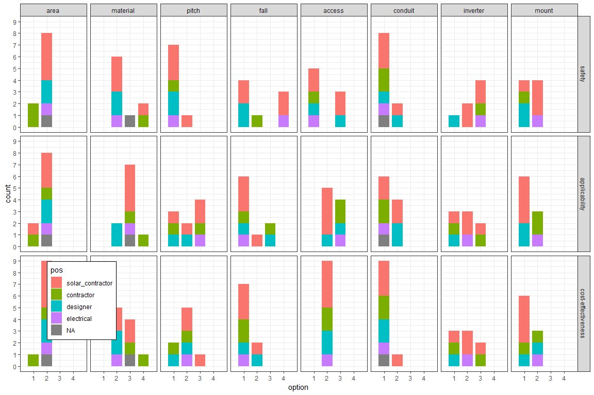
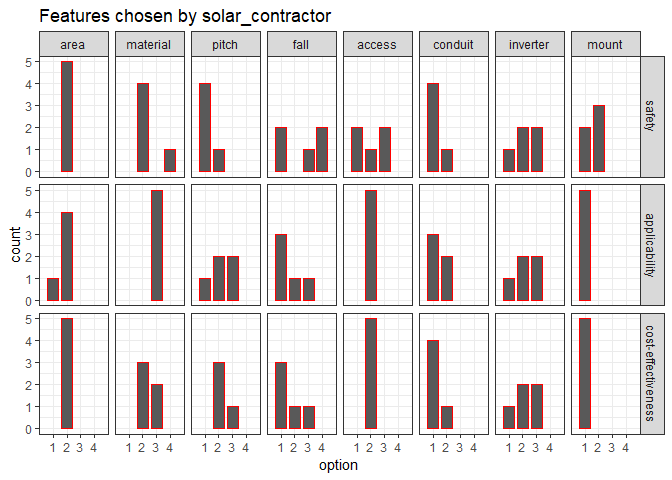
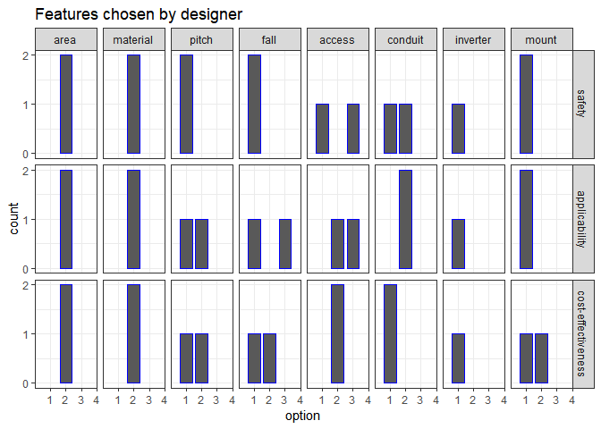
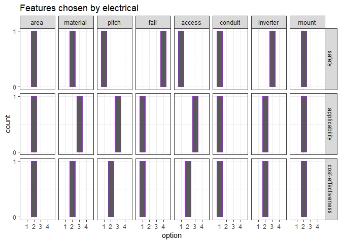

## Survey legend

```
area
1: multi-split zones
2: one continuous zone

material
1: tile or shake
2: compositions
3: metal
4: others

pitch
1: flat
2: lower
3: moderate
4: steep

fall
1: hitch clip
2: roof bracket
3: lifeline
4: others

access
1: scaffolding
2: ladder
3: mechanical lift

conduit
1: running in advance
2: routes decided but not running

inverter
1: string
2: power optimizer
3: micro

mounting
1: rack
2: ballast
```

## Survey results


```r
g_ov_sur
```

<!-- -->


### Solar contractor


```r
f_sur("solar_contractor")
```

<!-- -->


### General contractor


```r
f_sur("contractor")
```

<!-- -->


### Designer


```r
f_sur("designer")
```

<!-- -->


### Electrical professional

```r
f_sur("electrical")
```

<!-- -->


## Takeaways

### Solar zone area

The majority of professionals consider one continuous zone is desirable for all criteria.

### Solar zone material

Compositions are the most desirable for the safety criteria while metal (standing seam) is the one as far as applicability is concerned. When in comes to the cost-effectiveness compositions and metal are considered almost the same. In general metal is expensive with higher upfront cost. But, with respect to durability and maintenance, metal could be cost-effective as much as compositions.

### Solzar zone pitch

Flat is the safest feature for the solar zone pitch in the survey. For cost-effectiveness, lower slope is the desirable one.

### Fall protection

Hitch clip or tie-off is the feature chosen the most for all the criteria of safety, applicability and cost-effectiveness. There were some other suggestions such as guardrail for the safety criteria.

### Access to roof

Ladder is the most desirable for the cost-effectiveness and applicability criteria while when safety is concerned, none selected ladder while the other options, such as scaffolding and mechanical lift, are chosen to be desirable.

### Conduit for the future solar system

Most of respondents vote for running conduits in advance for safety, applicability and cost-effectiveness.

### Solar system inverter

Micro inverter was chosen as the most desirable for the safety. When it comes to applicability and cost-effectiveness there are not much differences among the features. In practice, depending on the solar system and the roof condition, the desirable inverter would be different. Larger capacity of the system would need string inverters like in commercial projects. Micro inverter and power optimizer are more desirable for smaller systems and more dynamic conditions such as marginal shading and complicated roof. Micro inverter leads to having many electronic components on the zone requiring more maintenance cost. Power optimizer on the other hand, still has a central inverter unlike micro inverter while having the similar performance as the micro inverter. The point is where the DC converts to AC as micro inverter inverts DC to AC on the solar zone which leads to the safest feature among other inverter options.

### Solar system mounting

Racking type is more desirable than ballast type for applicability and cost-effectiveness. For the safety criteria, there was not difference between the options while most of solar contractors chose ballast is safer.

> Commercial contractor seems to prefer flat and ballast to other options regardless of criteria.

> Other material option such as TPO and ballast mounting type is likely determined by the design of solar zone pitch such that flat pitch would entail TPO or other similar material and ballast mounting type for the solar system.

> There are conflicts of different objectives in terms of safety. Composition materials, flat pitch, scaffolding or mechanical lift for accessing the roof, and micro inverter are the most desirable features in an independent perspective for safety while the most desirable set of features could be variable and context dependent. Nevertheless, one continous solar zone area, tie-off fall protection, and running conduit in advance are the features to enhance the safety of the current practice. 


